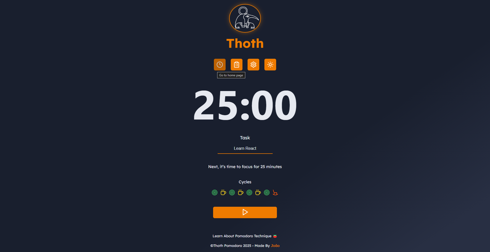
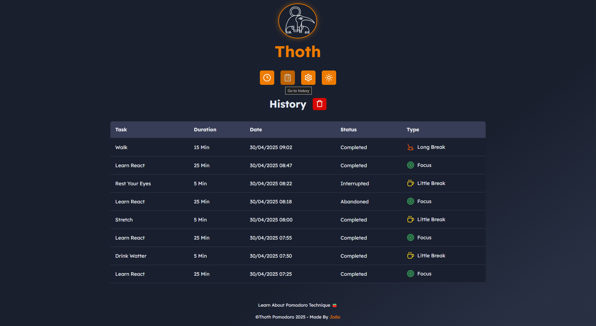
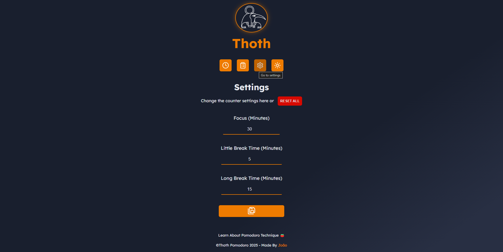
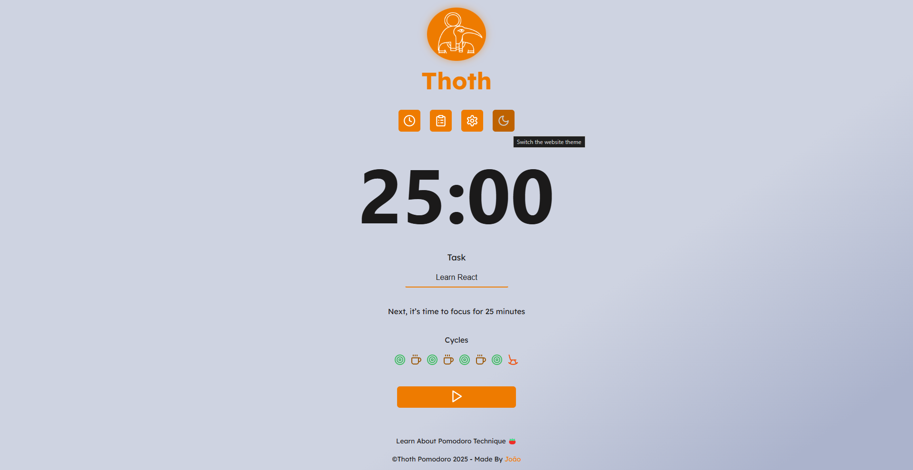

# Thoth-Pomodoro

**Thoth-Pomodoro** was developed to help you manage your Pomodoro cycles.

---

## 🚀 Features

- **Home Page**: On the Home page, you can start your tasks and track your progress.  
  
- **History Page**: On the History page, you can view your history tasks in progress, completed,
  interrupted, and abandoned. You can also delete all history.  
  
- **Settings Page**: On the Settings page, you can customize your focus time, short breaks, and long
  breaks to suit your workflow. You can also reset the site to default settings.  
  
- **Theme**: Prefer a light theme? Use the Theme option in the menu to toggle between light and dark
  modes.  
  

---

## 🛠️ Technologies Used

This project was developed using the following technologies:

- **[React 19.0.0](https://react.dev/)** – A JavaScript library for building user interfaces.
- **[React Router 7.5.3](https://reactrouter.com/)** – A declarative routing library for React
  applications.
- **[React-Toastify 11.0.5](https://fkhadra.github.io/react-toastify/introduction/)** – Allows you
  to add notifications to your app with ease.
- **[Lucide-React 0.503.0](https://lucide.dev/)** – An icon library for React applications.
- **[date-fns 4.1.0](https://date-fns.org/)** – A library for manipulating and formatting JavaScript
  dates.

---

## 💻 How to Run the Project

### 1. Clone the Repository

```bash
git clone https://github.com/joao-sl/Thoth-Pomodoro.git
cd Thoth-Pomodoro
```

### 2. Install Dependencies

Using npm:

```bash
npm install
```

Or Yarn:

```bash
yarn
```

### 3. Run in Development Mode

```bash
npm run dev
```

The app will be available at console link.

---

## 📞 Contact

If you have any questions, suggestions, or want to collaborate, feel free to get in touch!

**LinkedIn:** [João Victor](https://www.linkedin.com/in/joao-sl-dev/)
